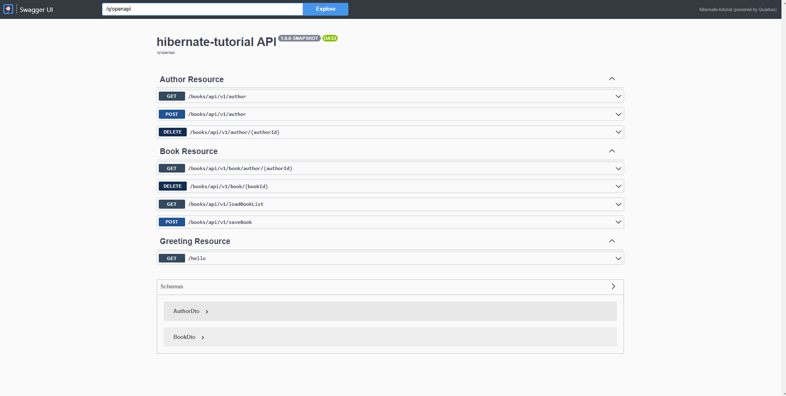

= Отчет по лабораторной работе 5
:listing-caption: Листинг
:figure-caption: Рис
:source-highlighter: coderay

Студент: Беляев Максим

Группа: ПИМ-22

== 1. Постановка задачи

В процессе выполнения лабораторной работы необходимо выполнить следующие задачи:

. Метод добавления автора
. Вывод всех книг по ид автора
. Удаление книги
. Удаление автора

== 2. Разработка задачи

=== 2.1 Структура проекта

Проект разделен на следующие директории:

docs:::
Данная документация

src:::
Исходный код лабораторной работы

src/main/java/ru/rsatu/hibernatetutorial/mapper:::
Мапперы Dto в Entity и наоборот

src/main/java/ru/rsatu/hibernatetutorial/pojo/entity:::
Entity `Book` и `Author`

src/main/java/ru/rsatu/hibernatetutorial/pojo/dto:::
DTO для Entity `Book` и `Author`

src/main/java/ru/rsatu/hibernatetutorial/repository:::
Репозитории для сущностей `Book` и `Author`

src/main/java/ru/rsatu/hibernatetutorial/resource:::
Ресурсы `BookResource` и `AuthorResource`

src/main/java/ru/rsatu/hibernatetutorial/service:::
43234

== 3. Информация о реализации

=== 3.1 Задание 1

Для выполнения первого задания созданы следующие классы:

- AuthorDto - Dto для entity `Author`.
- AuthorMapper - Mapper, для entity `Author` и dto `AuthorDto` преобразующий их между собой
- AuthorsRepository - Репозиторий, обращающийся к базе данных для entity `Author`. Содержащий методы `saveAuthor` и `getAuthors` для создания автора и получения списка всех авторов
- AuthorsService - Сервис, через который взаимодействуют `AuthorResource`, `AuthorsRepository` и `AuthorMapper`. Содержащий аналогичные методы.
- AuthorResource - Ресурс, через который можно взаимодействовать с сущностью `Author` по http. Обрабатывающий запросы `GET /books/api/v1/author` и `POST /books/api/v1/author`

.AuthorDto
[source,java]
----
package ru.rsatu.hibernatetutorial.pojo.dto;

import lombok.Getter;
import lombok.Setter;

@Getter
@Setter
public class AuthorDto {

    private Long id;
    private String name;
    private String birthDate;
    private String nickName;
}
----

.AuthorMapper

[source,java]
----
package ru.rsatu.hibernatetutorial.mapper;

import org.mapstruct.Mapper;
import org.mapstruct.Mapping;
import ru.rsatu.hibernatetutorial.pojo.dto.AuthorDto;
import ru.rsatu.hibernatetutorial.pojo.entity.Author;

@Mapper(componentModel = "cdi")
public abstract class AuthorMapper {

    @Mapping(target = "id", source = "id")
    @Mapping(target = "name", source = "name")
    @Mapping(target = "birthDate", source = "birthDate", dateFormat = "dd.MM.yyyy")
    @Mapping(target = "nickName", source = "nickName")
    public abstract AuthorDto toAuthorDto(Author author);

    @Mapping(target = "id", source = "id")
    @Mapping(target = "name", source = "name")
    @Mapping(target = "birthDate", source = "birthDate", dateFormat = "dd.MM.yyyy")
    @Mapping(target = "nickName", source = "nickName")
    public abstract Author toAuthor(AuthorDto authorDto);
}

----

.AuthorsRepository

[source,java]
----
package ru.rsatu.hibernatetutorial.repository;

import ru.rsatu.hibernatetutorial.mapper.AuthorMapper;
import ru.rsatu.hibernatetutorial.pojo.dto.AuthorDto;
import ru.rsatu.hibernatetutorial.pojo.entity.Author;

import javax.enterprise.context.ApplicationScoped;
import javax.inject.Inject;
import javax.persistence.EntityManager;
import javax.transaction.Transactional;
import java.util.List;

/**
 * Репозиторий для работы с авторами
 */
@ApplicationScoped
public class AuthorsRepository {

    @Inject
    EntityManager entityManager;

    @Inject
    AuthorMapper authorMapper;

    /**
     * Получить всех авторов
     */
    public List<Author> getAuthors() {
        return entityManager.createQuery("select a from Author a", Author.class)
                .getResultList();
    }

    /**
     * Сохранение автора
     */
    @Transactional
    public Author saveAuthor(AuthorDto authorDto) {
        Author author = authorMapper.toAuthor(authorDto);
        if (author.getId() != null) {
            entityManager.merge(author);
        } else {
            entityManager.persist(author);
        }
        entityManager.flush();
        return author;
    }

}
----

.AuthorsService
[source, java]
----
package ru.rsatu.hibernatetutorial.service;

import ru.rsatu.hibernatetutorial.mapper.AuthorMapper;
import ru.rsatu.hibernatetutorial.mapper.BookMapper;
import ru.rsatu.hibernatetutorial.pojo.dto.AuthorDto;
import ru.rsatu.hibernatetutorial.pojo.dto.BookDto;
import ru.rsatu.hibernatetutorial.repository.AuthorsRepository;
import ru.rsatu.hibernatetutorial.repository.BooksRepository;

import javax.enterprise.context.ApplicationScoped;
import javax.inject.Inject;
import java.util.List;

/**
 * Сервис для работы с авторами
 */
@ApplicationScoped
public class AuthorsService {

    @Inject
    AuthorMapper authorMapper;

    @Inject
    AuthorsRepository authorsRepository;

    /**
     * Получить всех авторов
     */
    public List<AuthorDto> getAuthors() {
        return authorsRepository.getAuthors()
                .stream()
                .map(authorMapper::toAuthorDto)
                .toList();
    }

    /**
     * Сохранение автора
     */
    public AuthorDto saveAuthor(AuthorDto authorDto) {
        return authorMapper.toAuthorDto(authorsRepository.saveAuthor(authorDto));
    }
}
----

.AuthorResouce
[source,java]
----
package ru.rsatu.hibernatetutorial.resource;

import ru.rsatu.hibernatetutorial.pojo.dto.AuthorDto;
import ru.rsatu.hibernatetutorial.service.AuthorsService;

import javax.inject.Inject;
import javax.transaction.Transactional;
import javax.ws.rs.*;
import javax.ws.rs.core.MediaType;
import java.util.List;

@Path("/books/api/v1")
public class AuthorResource {

    @Inject
    AuthorsService authorsService;

    /**
     * Получение всех авторов
     */
    @GET
    @Path("/author")
    public List<AuthorDto> getAuthors() {
        return authorsService.getAuthors();
    }

    /**
     * Сохранение автора
     */
    @POST
    @Consumes(MediaType.APPLICATION_JSON)
    @Produces(MediaType.APPLICATION_JSON)
    @Path("/author")
    public AuthorDto saveAuthor(AuthorDto authorDto) {
        return authorsService.saveAuthor(authorDto);
    }
}

----

Так же был модфицирован класс `Author`, id авторов сделаны автогенерируемыми:

.Author
[source, java]
----
@Getter
@Setter
@Entity
@Table(name = "authors")
public class Author {

    @Id
    @GeneratedValue(strategy = GenerationType.SEQUENCE, generator = "authors_id_gen")
    @SequenceGenerator(name = "authors_id_gen", sequenceName = "authors_id_gen_seq", initialValue = 1, allocationSize = 10)
    private Long id;
    private String name;
    private Date birthDate;
    private String nickName;

}

----

Для проверки работоспособности добавим с помощью Swagger следующих авторов:

.Добавляемые авторы
[source, json]
----
{
  "name": "Author1",
  "birthDate": "01.01.1999",
  "nickName": "author1"
}
----
[source,json]
----
{
  "name": "Author2",
  "birthDate": "02.02.2000",
  "nickName": "author2"
}
----

И запросим список всех авторов:

.Результаты выполнения запроса
[source, json]
----
[
  {
    "id": 1,
    "name": "Author1",
    "birthDate": "01.01.1999",
    "nickName": "author1"
  },
  {
    "id": 2,
    "name": "Author2",
    "birthDate": "02.02.2000",
    "nickName": "author2"
  }
]
----

=== 3.2 Задание 2

Для выполнения этого задания модифицируем класс `BookResource` и добавим новый метод:

`GET /book/author/{authorId}`

.Добавленный метод в `BookResource`
[source, java]
----
@GET
@Path("/book/author/{authorId}")
public List<BookDto> getBooksByAuthor(@PathParam("authorId") Long authorId) {
    return booksService.getBooksByAuthor(authorId);
}
----

Для работы этого метода доработаем классы `BooksRepository` и `BookService` добавив в них методы `getBooksByAuthor`:

.Модифицированный BookRepository
[source, java]
----
package ru.rsatu.hibernatetutorial.repository;

import ru.rsatu.hibernatetutorial.mapper.BookMapper;
import ru.rsatu.hibernatetutorial.pojo.dto.BookDto;
import ru.rsatu.hibernatetutorial.pojo.entity.Author;
import ru.rsatu.hibernatetutorial.pojo.entity.Book;

import javax.enterprise.context.ApplicationScoped;
import javax.inject.Inject;
import javax.persistence.EntityManager;
import javax.transaction.Transactional;
import java.util.List;

/**
 * Репозиторий для работы с книгами
 */
@ApplicationScoped
public class BooksRepository {

    @Inject
    EntityManager entityManager;

    @Inject
    BookMapper bookMapper;

    /**
     * Загрузить все книги
     */
    public List<Book> loadBooks() {
        return entityManager.createQuery("select b from Book b", Book.class)
                .getResultList();
    }

    /**
     * Получить книги по id автора
     */
    public List<Book> getBooksByAuthor(Long authorId) {
        return entityManager.createQuery("select b from Book b where author.id = :authorId", Book.class).setParameter("authorId", authorId).getResultList();
    }

    /**
     * Сохранение книги
     */
    @Transactional
    public Book saveBook(BookDto bookDto) {
        Book book = bookMapper.toBook(bookDto);
        if (book.getId() != null) {
            entityManager.merge(book);
        } else {
            entityManager.persist(book);
        }
        entityManager.flush();
        return book;
    }
}
----

.Модифицированный BooksService
[source, java]
----
package ru.rsatu.hibernatetutorial.service;

import ru.rsatu.hibernatetutorial.mapper.BookMapper;
import ru.rsatu.hibernatetutorial.pojo.dto.BookDto;
import ru.rsatu.hibernatetutorial.repository.BooksRepository;

import javax.enterprise.context.ApplicationScoped;
import javax.inject.Inject;
import java.util.List;

/**
 * Сервис для работы с книгами
 */
@ApplicationScoped
public class BooksService {

    @Inject
    BookMapper bookMapper;

    @Inject
    BooksRepository booksRepository;

    /**
     * Загрузить все книги
     */
    public List<BookDto> loadBookList() {
        return booksRepository.loadBooks()
                .stream()
                .map(bookMapper::toBookDto)
                .toList();
    }

    /**
     * Загрузить книги конкретного автора по id
     */

    public List<BookDto> getBooksByAuthor(Long authorId) {
        return booksRepository.getBooksByAuthor(authorId)
                .stream()
                .map(bookMapper::toBookDto)
                .toList();
    }

    /**
     * Сохранение книги
     */
    public BookDto saveBook(BookDto bookDto) {
        return bookMapper.toBookDto(booksRepository.saveBook(bookDto));
    }
}
----

Для проверки работоспособности добавим следующие книги с помощью Swagger:

.Добавляемые книги
[source,json]
----
{
  "name": "Book1",
  "authorId": 1
}
----
[source,json]
----
{
  "name": "Book2",
  "authorId": 2
}
----

Запросим все книги автора с id 1:

.Ответ сервера с authorId = 1
[source, json]
----
[
  {
    "id": 1,
    "name": "Book1",
    "authorId": 1
  }
]
----

.Ответ сервера с authorId = 2
[source, json]
----
[
  {
    "id": 2,
    "name": "Book2",
    "authorId": 2
  }
]
----

=== 3.3 Задание 3

Для реализации возможности удалять книги добавим необходимые методы в классы:

- BooksRepository - `public void deleteBook(Long bookId)`
- BooksService - `public void deleteBook(Long bookId)`
- BookResource - `DELETE /books/api/v1/book/{bookId}`

.Изменения в BooksRepository:
[source,java]
----
/**
 * Удаление книги
 */
@Transactional
public void deleteBook(Long bookId) {
    Book book = entityManager.find(Book.class, bookId);
    entityManager.remove(book);
}
----

.Изменения в BooksService
[source, java]
----
/**
 * Удаление книги
 */
public void deleteBook(Long bookId) {
    booksRepository.deleteBook(bookId);
}
----

.Изменения в BookResource
[source, java]
----
@DELETE
@Path("/book/{bookId}")
public void deleteBook(@PathParam("bookId") Long bookId) {
    booksService.deleteBook(bookId);
}
----

Для проверки удалим ранее созданную книгу с id = 1:

`DELETE /books/api/v1/book1`

Ответ сервера:

`Code 204 - No Content`

Проверим отсуствие книги в списке книг:

.Результат выполнения запроса /loadBookList
[source, json]
----
[
  {
    "id": 2,
    "name": "Book2",
    "authorId": 2
  }
]
----

=== 3.4 Задание 4

Для реализации возможности удалять авторов необходимо модифицировать entity `Book` и добавить каскадное удаление при удалении автора:

.Модифицированный класс Book
[source, java]
----
package ru.rsatu.hibernatetutorial.pojo.entity;

import lombok.Getter;
import lombok.Setter;
import org.hibernate.annotations.OnDelete;
import org.hibernate.annotations.OnDeleteAction;

import javax.persistence.*;

/**
 * Книга
 */
@Getter
@Setter
@Entity
@Table(name = "books")
public class Book {

    @Id
    @GeneratedValue(strategy = GenerationType.SEQUENCE, generator = "books_id_gen")
    @SequenceGenerator(name = "books_id_gen", sequenceName = "books_id_gen_seq", initialValue = 1, allocationSize = 10)
    private Long id;

    private String name;

    @ManyToOne
    @JoinColumn(name = "author_id")
    @OnDelete(action = OnDeleteAction.CASCADE)
    private Author author;

}
----

Так же потребуется добавить метод `DELETE /books/api/v1/author/{authorId}` в `AuthorResource` и необходимые для его работы методы в `AuthorsService` и `AuthorsRepository`

.Полученный в результате выполенния лабораторной работы класс AuthorsRepository
[source, java]
----
package ru.rsatu.hibernatetutorial.repository;

import ru.rsatu.hibernatetutorial.mapper.AuthorMapper;
import ru.rsatu.hibernatetutorial.pojo.dto.AuthorDto;
import ru.rsatu.hibernatetutorial.pojo.entity.Author;

import javax.enterprise.context.ApplicationScoped;
import javax.inject.Inject;
import javax.persistence.EntityManager;
import javax.transaction.Transactional;
import java.util.List;

/**
 * Репозиторий для работы с авторами
 */
@ApplicationScoped
public class AuthorsRepository {

    @Inject
    EntityManager entityManager;

    @Inject
    AuthorMapper authorMapper;

    /**
     * Получить всех авторов
     */
    public List<Author> getAuthors() {
        return entityManager.createQuery("select a from Author a", Author.class)
                .getResultList();
    }

    /**
     * Сохранение автора
     */
    @Transactional
    public Author saveAuthor(AuthorDto authorDto) {
        Author author = authorMapper.toAuthor(authorDto);
        if (author.getId() != null) {
            entityManager.merge(author);
        } else {
            entityManager.persist(author);
        }
        entityManager.flush();
        return author;
    }

    /**
     * Удаление автора
     */
    @Transactional
    public void deleteAuthor(Long authorId) {
        Author author = entityManager.find(Author.class, authorId);
        entityManager.remove(author);
    }

}
----

.Полученный в результате выполенния лабораторной работы класс AuthorsService
[source, java]
----
package ru.rsatu.hibernatetutorial.service;

import ru.rsatu.hibernatetutorial.mapper.AuthorMapper;
import ru.rsatu.hibernatetutorial.mapper.BookMapper;
import ru.rsatu.hibernatetutorial.pojo.dto.AuthorDto;
import ru.rsatu.hibernatetutorial.pojo.dto.BookDto;
import ru.rsatu.hibernatetutorial.repository.AuthorsRepository;
import ru.rsatu.hibernatetutorial.repository.BooksRepository;

import javax.enterprise.context.ApplicationScoped;
import javax.inject.Inject;
import java.util.List;

/**
 * Сервис для работы с авторами
 */
@ApplicationScoped
public class AuthorsService {

    @Inject
    AuthorMapper authorMapper;

    @Inject
    AuthorsRepository authorsRepository;

    /**
     * Получить всех авторов
     */
    public List<AuthorDto> getAuthors() {
        return authorsRepository.getAuthors()
                .stream()
                .map(authorMapper::toAuthorDto)
                .toList();
    }

    /**
     * Сохранение автора
     */
    public AuthorDto saveAuthor(AuthorDto authorDto) {
        return authorMapper.toAuthorDto(authorsRepository.saveAuthor(authorDto));
    }

    /**
     * Удаление автора
     */
    public void deleteAuthor(Long authorId) {
        authorsRepository.deleteAuthor(authorId);
    }

}
----

.Полученный в результате выполенния лабораторной работы класс AuthorResource
[source, java]
----
package ru.rsatu.hibernatetutorial.resource;

import ru.rsatu.hibernatetutorial.pojo.dto.AuthorDto;
import ru.rsatu.hibernatetutorial.service.AuthorsService;

import javax.inject.Inject;
import javax.transaction.Transactional;
import javax.ws.rs.*;
import javax.ws.rs.core.MediaType;
import java.util.List;

@Path("/books/api/v1")
public class AuthorResource {

    @Inject
    AuthorsService authorsService;

    /**
     * Получение всех авторов
     */
    @GET
    @Path("/author")
    public List<AuthorDto> getAuthors() {
        return authorsService.getAuthors();
    }

    /**
     * Сохранение автора
     */
    @POST
    @Consumes(MediaType.APPLICATION_JSON)
    @Produces(MediaType.APPLICATION_JSON)
    @Path("/author")
    public AuthorDto saveAuthor(AuthorDto authorDto) {
        return authorsService.saveAuthor(authorDto);
    }

    /**
     * Удаление автора
     */
    @DELETE
    @Path("/author/{authorId}")
    public void deleteAuthor(@PathParam("authorId") Long authorId) {
        authorsService.deleteAuthor(authorId);
    }

}
----

Для проверки работоспособности удалим автора с id = 2

`DELETE /books/api/v1/author/2`

Ответ сервера:

`204 - No Content`

Проверим список авторов:

.Список авторов, полученный с помощью запроса GET /books/api/v1/author
[source,json]
----
[
  {
    "id": 1,
    "name": "Author1",
    "birthDate": "01.01.1999",
    "nickName": "author1"
  }
]
----

Автор с id = 2 успешно удален

Так же проверим что удалились книги, относящиеся к данному автору:

.Список книг, полученный с сервера
[source, json]
----
[]
----

Книги так же успешно удалены

== 4. Результаты выполнения

В результате выполнения лабораторной работы разработан back-end сервер обрабатывающий следующие запросы:

- `GET /books/api/v1/author` - получение списка всех авторов
- `POST /books/api/v1/author` - создание нового автора
- `DELETE /books/api/v1/author/{authorId}` - удаление автора с указанным id
- `GET /books/api/v1/book/author/{authorId}` - получение книг по заданному автору
- `DELETE /books/api/v1/book/{bookId}` - удаление книги по заданному id
- `GET /books/api/v1/loadBookList` - получение списка всех книг
- `POST /books/api/v1/saveBook` - создание новой книги

Результат открытия Swagger-ui

== 5. Вывод

В результате выполнения лабораторной работы получены навыки по созданию backend серверов с помощью hibernate и resteasy. А также по работе со swagger и rest-api.